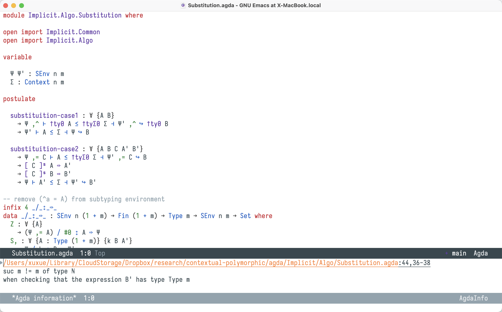

# Coq & Agda Configs of Emacs

Note: I'm currently tailoring `nano-theme` only for agda2-mode, for proof-general purpose, just switch to `xcode-theme` in `init.el`.

## Cheatsheet

In Emacs's universe, `C-x` stands for holding `Control` and then press `X`, `M-x` stands for holding Meta key `Cmd` and then press `X`.

### Proof General

| Shortcuts    | Functions                  |
|--------------|----------------------------|
| C-c C-return | run code to this point |
| M-p          | run previous command       |
| M-n          | run next command           |
| M-h | coq-Check |

### Agda Mode

| Shortcuts    | Functions                  |
|--------------|----------------------------|
| C-l | load file |
